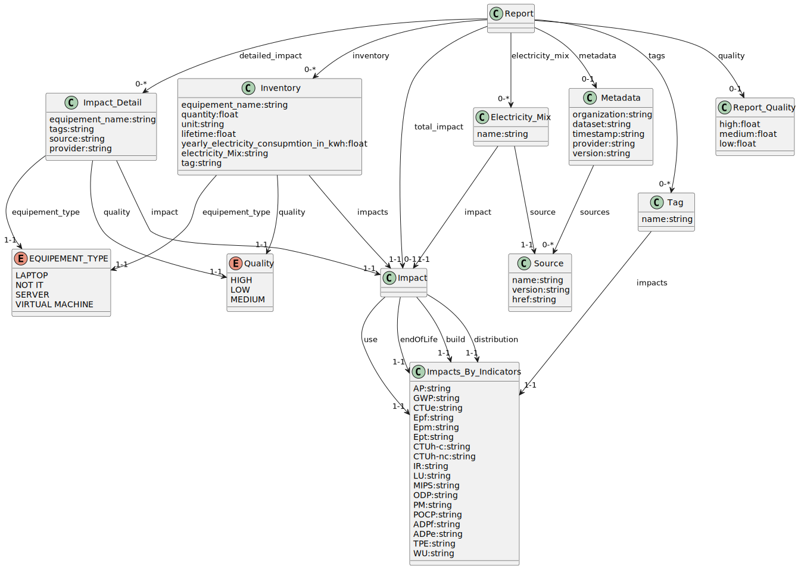

# what is?
First proposal for a Restfull API with a data model inspired by https://github.com/Boavizta/PCR-SI_dataformat/  .
* Only a Simple CRUD on Report is specified  
*    Post is use to post a report request  with the inventory and electricy / energy mix and should reply  an http status code 202  with  URI  of future report
*    Get is use to retrieve a specific report with its ID
*    Find is use de find a report with some criterias  

[Swagger is here](./swagger.yaml)  
[And in a live SwaggerUI ](https://petstore.swagger.io/?url=https://petstore.swagger.io/?url=https://raw.githubusercontent.com/sebwt/PCR-SI_dataformat/main/RestFullApiSpec/swagger.yaml)

Sub Resource management may be designing

# data model representation

# data model discordance

due to manual work there is some mismath between references, request, response & impact object, oas spec purpose to resolve it (but it's a manual work too ;-) 
