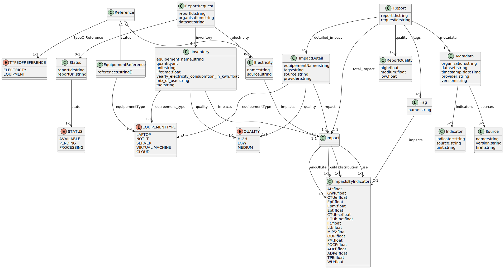

# what is?
First proposal for a Restfull API  implementation for https://github.com/Boavizta/PCR-SI_dataformat/  .
 API  purpose to 
*    Post a ReportRequest for a report engine
*    Find & Get a reportRequest & specificly its status
*    Retrieve a Report
   

[Swagger is here](./swagger.yaml)  
[And in a live SwaggerUI ](https://petstore.swagger.io/?url=https://raw.githubusercontent.com/sebwt/PCR-SI_dataformat/main/RestFullApiSpec/swagger.yaml)

Sub Resource management may be designing

# data model representation

# data model discordance

due to manual work there is some mismath between references, request, response & impact object, oas spec purpose to resolve it (but it's a manual work too ;-) 
